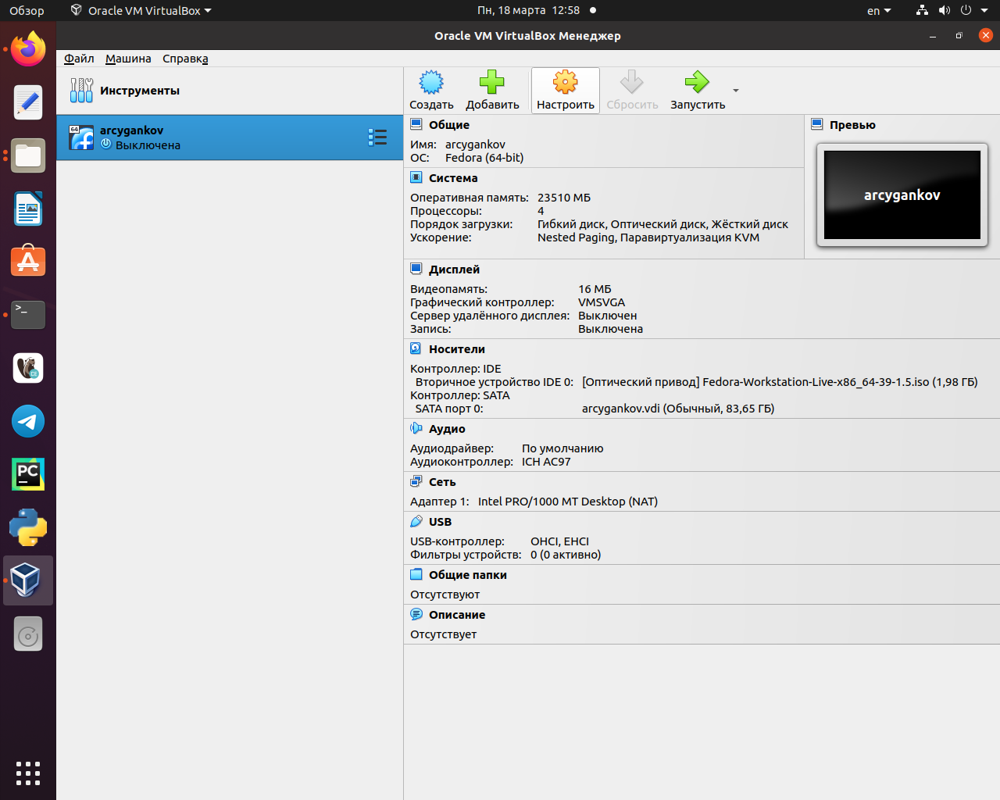
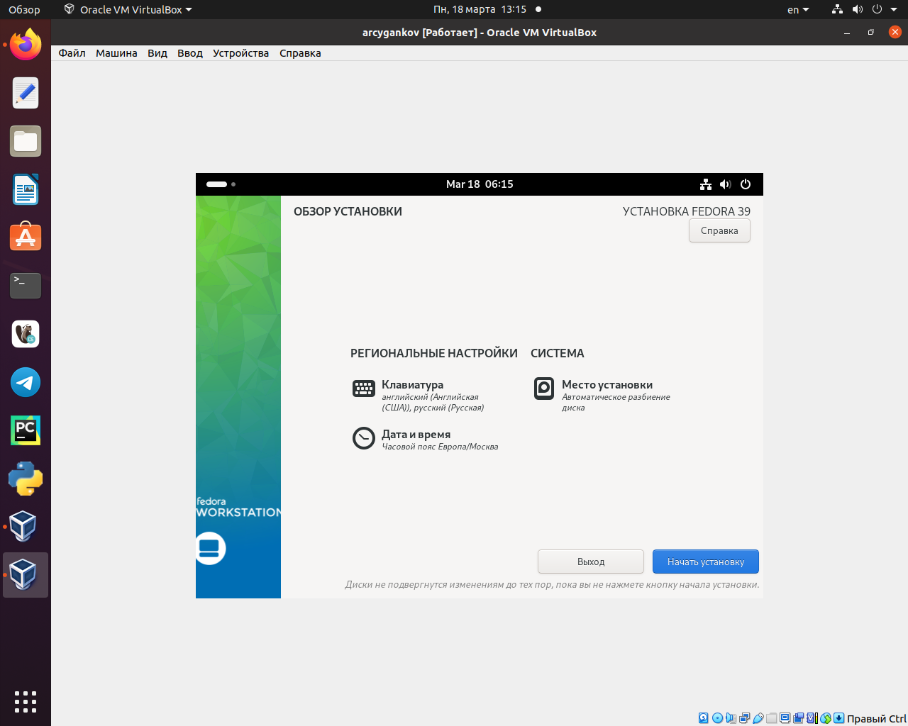
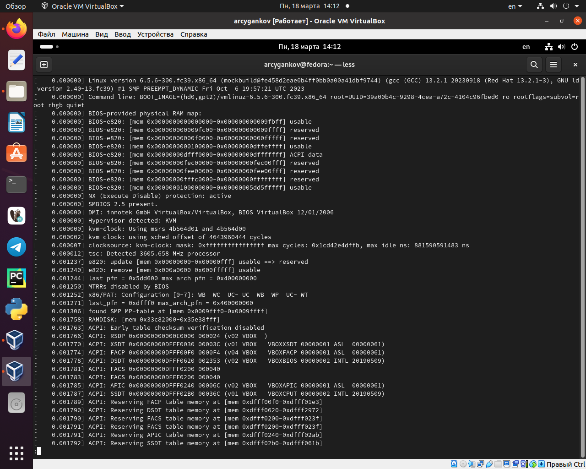
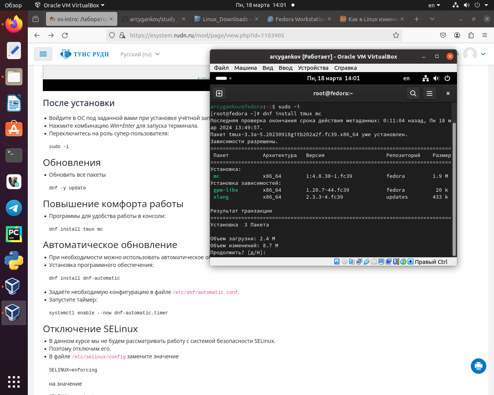
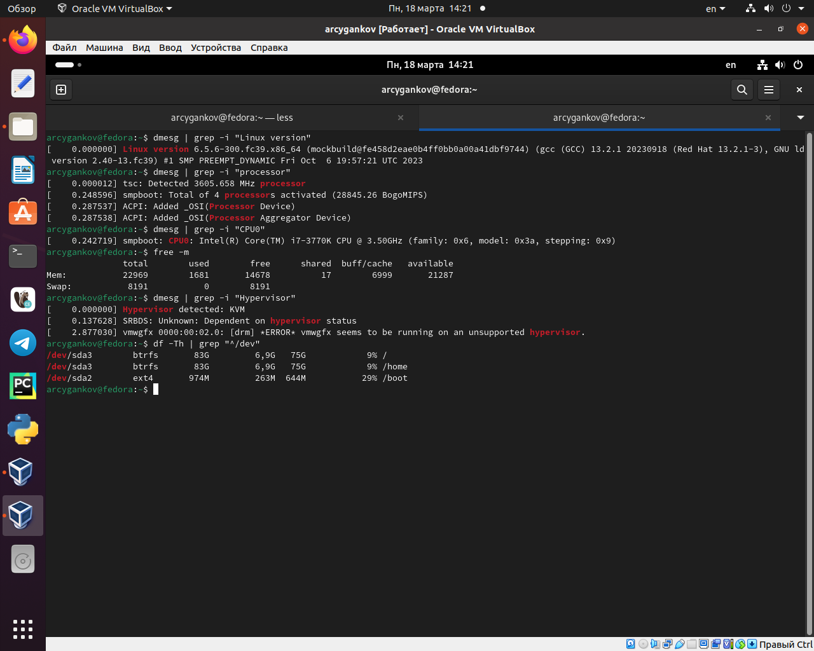
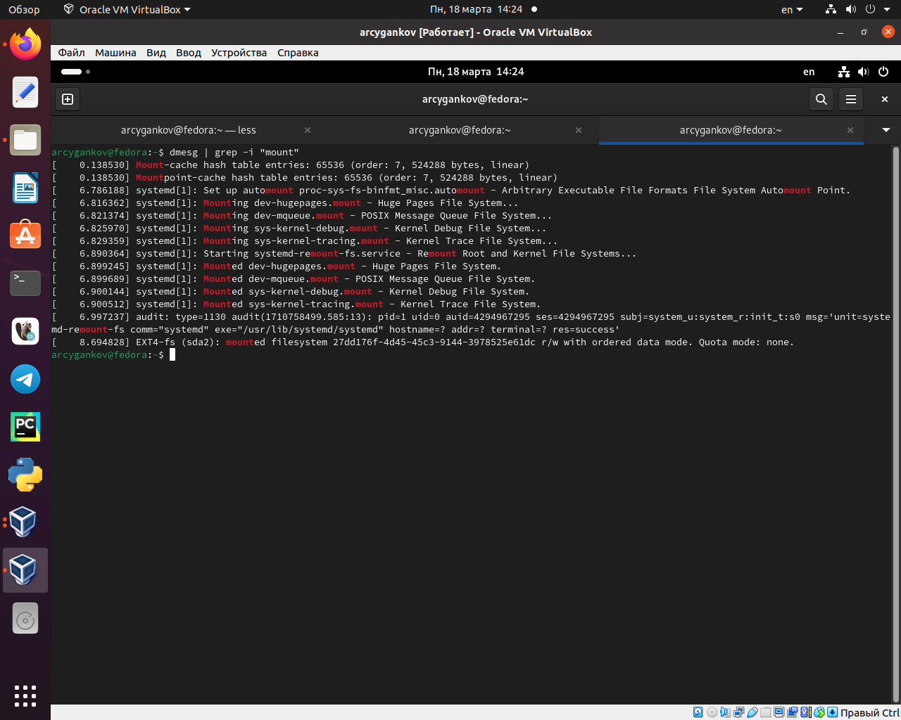

---
## Front matter
lang: ru-RU
title: "Лабораторная работа №1. Установка и конфигурация операционной системы на виртуальную машину"
subtitle: "Дисциплина: Операционные системы"
author:
  - Цыганков А. Р.
institute:
  - Группа НПМБВ-02-20
  - Российский университет дружбы народов, Москва, Россия
date: 23 марта 2024

## i18n babel
babel-lang: russian
babel-otherlangs: english

## Formatting pdf
toc: false
toc-title: Содержание
slide_level: 2
aspectratio: 169
section-titles: true
theme: metropolis
header-includes:
 - \metroset{progressbar=frametitle,sectionpage=progressbar,numbering=fraction}
 - '\makeatletter'
 - '\beamer@ignorenonframefalse'
 - '\makeatother'
---

# Информация

## Докладчик

:::::::::::::: {.columns align=center}
::: {.column width="70%"}

  * Цыганков Александр Романович
  * Студент 4го курса, группа НПМБВ-02-20
  * Прикладная математика
  * Российский университет дружбы народов
  * [Ссылка на репозиторий гитхаба arcygankov](https://github.com/arcygankov/study_2023-2024_os-intro/tree/master)

:::
::: {.column width="30%"}

:::
::::::::::::::

# Вводная часть

## Актуальность

- Навыки работы с ОС в настоящее время незаменимы
- Linux - ОС, которая с каждым годом получает все большее распространения
- Умение использовать и настраивать виртуальные машины полезно как в обучающих целях, так и в работе

## Объект и предмет исследования

- Программа VirtualBox
- ОС Linux, дистрибутив Fedora

## Цели и задачи

- Приобретение практических навыков установки операционной системы на виртуальную машину
- Приобретение навыка настройки минимально необходимых для дальнейшей работы сервисов

# Настройка виртуальной машины

## Скачивание и настройка

{#fig:001 width=50%}

## Установка Linux (Fedora)

{#fig:002 width=50%}

## Процесс запуска

{#fig:003 width=50%}

## Программа для работы с файлами

{#fig:004 width=50%}

## Команды для определения некоторых данных о системе.

{#fig:005 width=50%}

{#fig:006 width=50%}

# Результаты работы

- Настроено автоматическое обновление
- Установлены драйвера
- Произведена настройка раскладки клавиатуры
- Установлены удобные инструменты для работы в терминале, а также с документами