---
## Front matter
title: "Отчёт по лабораторной работе №1"
subtitle: "Дисциплина: Операционные системы"
author: "Цыганков Александр Романович, НПМбВ 02-20"

## Generic otions
lang: ru-RU
toc-title: "Содержание"

## Bibliography
bibliography: bib/cite.bib
csl: pandoc/csl/gost-r-7-0-5-2008-numeric.csl

## Pdf output format
toc: true # Table of contents
toc-depth: 2
lof: true # List of figures
lot: true # List of tables
fontsize: 12pt
linestretch: 1.5
papersize: a4
documentclass: scrreprt
## I18n polyglossia
polyglossia-lang:
  name: russian
  options:
	- spelling=modern
	- babelshorthands=true
polyglossia-otherlangs:
  name: english
## I18n babel
babel-lang: russian
babel-otherlangs: english
## Fonts
mainfont: PT Serif
romanfont: PT Serif
sansfont: PT Sans
monofont: PT Mono
mainfontoptions: Ligatures=TeX
romanfontoptions: Ligatures=TeX
sansfontoptions: Ligatures=TeX,Scale=MatchLowercase
monofontoptions: Scale=MatchLowercase,Scale=0.9
## Biblatex
biblatex: true
biblio-style: "gost-numeric"
biblatexoptions:
  - parentracker=true
  - backend=biber
  - hyperref=auto
  - language=auto
  - autolang=other*
  - citestyle=gost-numeric
## Pandoc-crossref LaTeX customization
figureTitle: "Рис."
tableTitle: "Таблица"
listingTitle: "Листинг"
lofTitle: "Список иллюстраций"
lotTitle: "Список таблиц"
lolTitle: "Листинги"
## Misc options
indent: true
header-includes:
  - \usepackage{indentfirst}
  - \usepackage{float} # keep figures where there are in the text
  - \floatplacement{figure}{H} # keep figures where there are in the text
---

# Цель работы

Целью данной работы является приобретение практических навыков установки операционной системы на виртуальную машину, настройки минимально необходимых для дальнейшей работы сервисов.

# Задание

1. Установить VirtualBox. 
2. Создать виртуальную машину.
3. Установить операционную систему linux и произвести первичные настройки.
4. Установить программы для удобства работы.
5. Домашнее задание.
6. Контрольные вопросы.

# Выполнение лабораторной работы

1. Я скачал VirtualBox и настроил каталог для виртуальных машин. (рис. [-@fig:001]) 
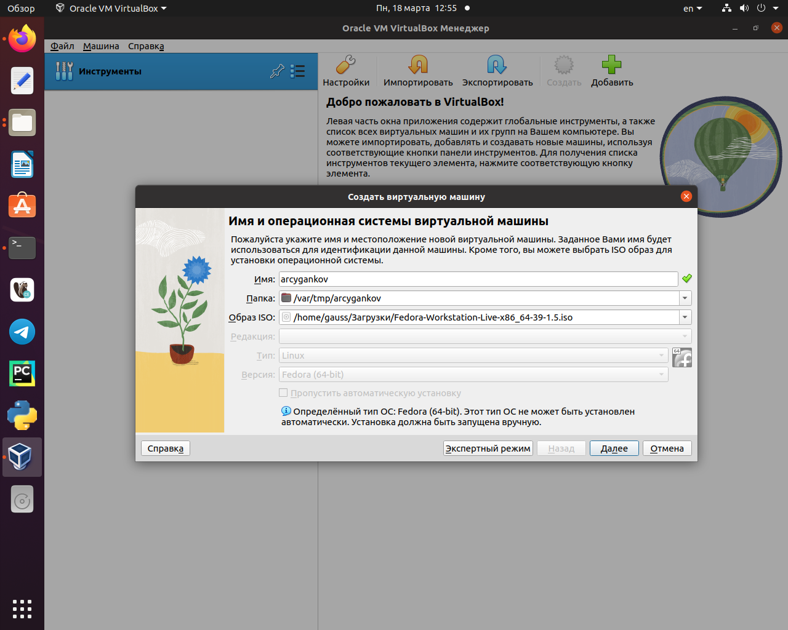
{#fig:001 width=70%}
2. Была создана виртуальная машина. И настроена ее начальная конфигурация и имена. (рис. [-@fig:002]), (рис. [-@fig:003]). 

{#fig:002 width=70%} 
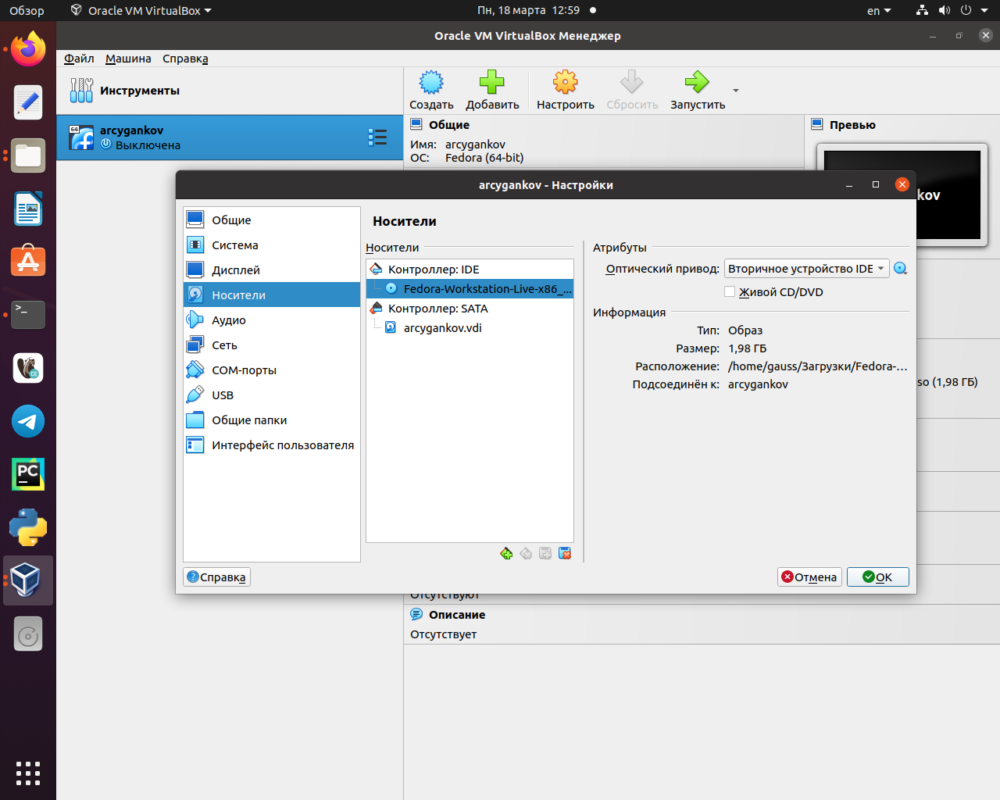 
{#fig:003 width=70%}
3. Далее была проведена Установка операционной системы. Также выполнены первичные настройки. (рис. [-@fig:004]), (рис. [-@fig:005]), (рис. [-@fig:006]), (рис. [-@fig:007]).
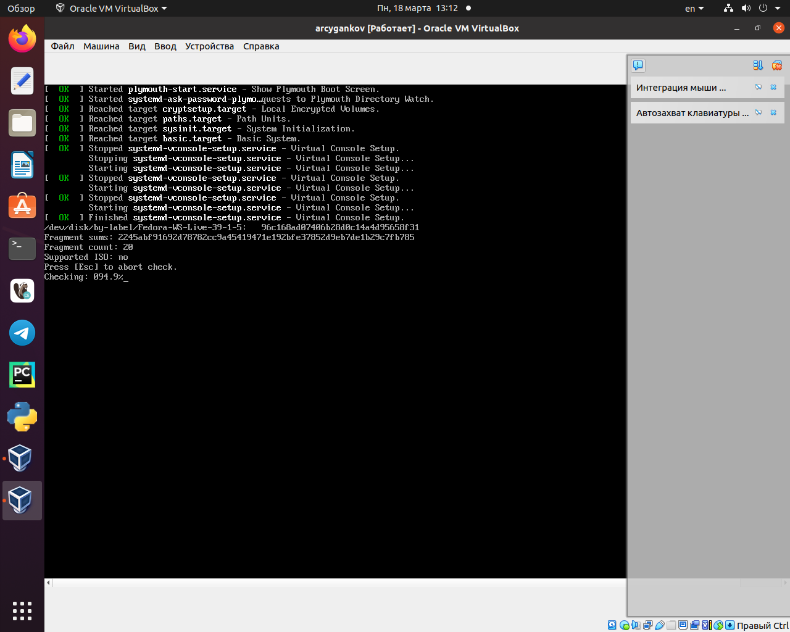
{#fig:004 width=70%} 
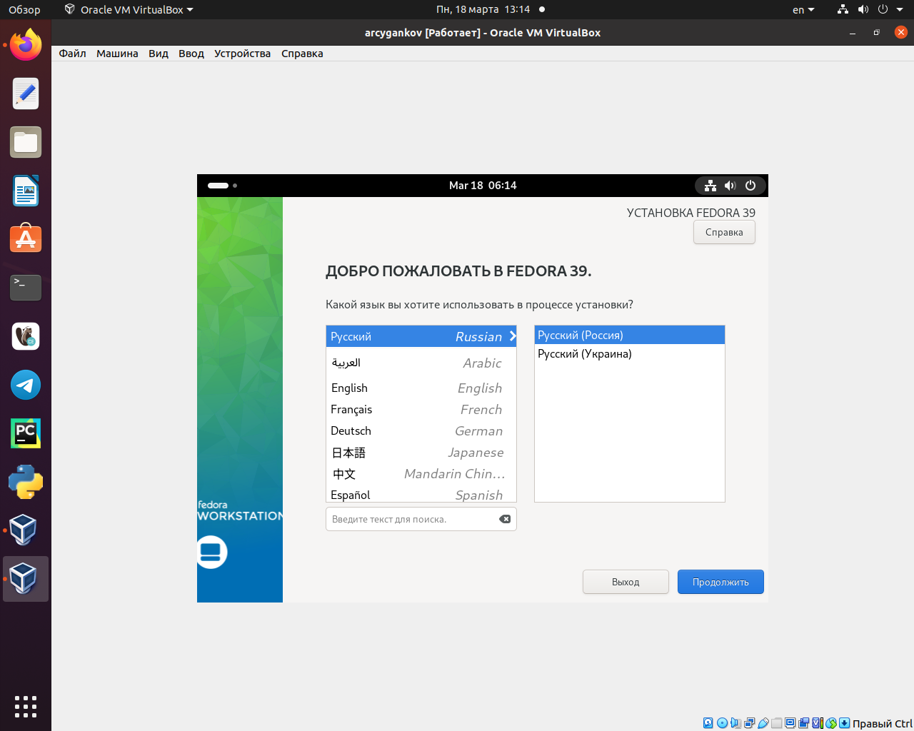 
{#fig:005 width=70%} 
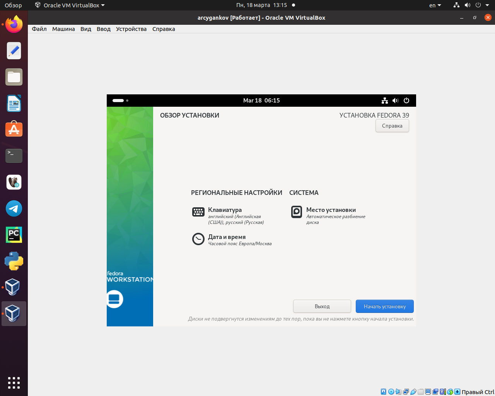 
{#fig:006 width=70%} 
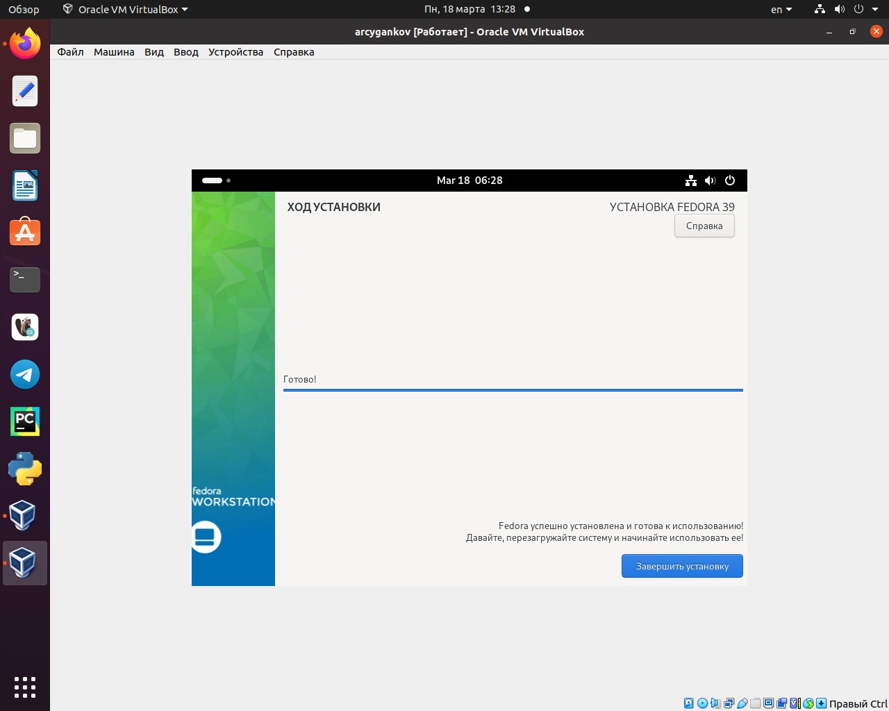 
{#fig:007 width=70%}
4. Далее проведена установка программ для более комфортной работы. Также похожими командами были установлены автообновления, драйвера, pandoc и т.п.(рис. [-@fig:008]), (рис. [-@fig:009]), (рис. [-@fig:010]), (рис. [-@fig:011]). 
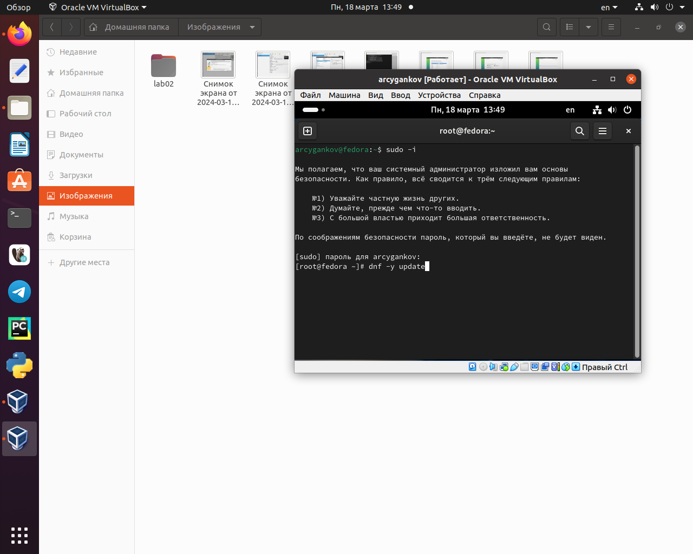 
{#fig:008 width=70%} 
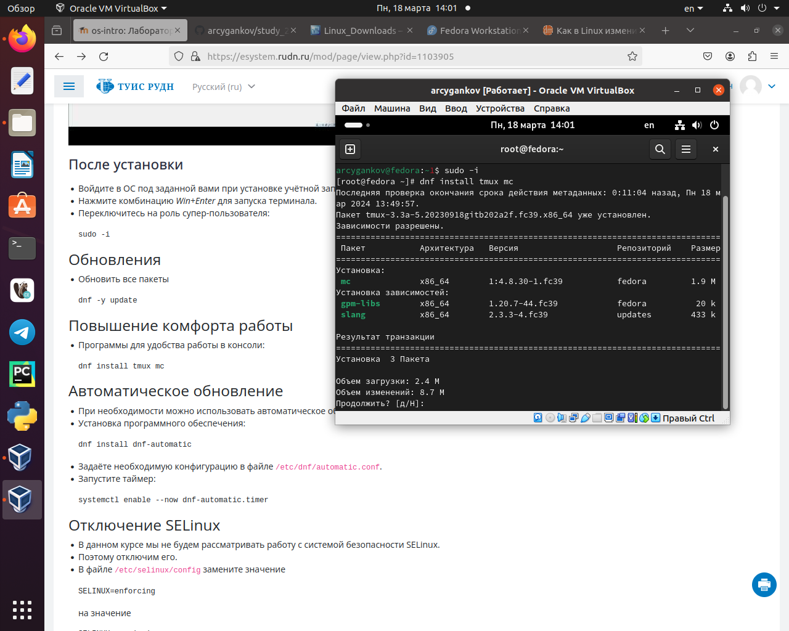 
{#fig:009 width=70%} 
 
{#fig:010 width=70%}
5. Домашнее задание. 	

	проанализировал последовательность загрузки системы, выполнив команду dmesg. (рис. [-@fig:011]). 
	 
	{#fig:010 width=70% dmesg} 
	
	Получил следующую информацию:
	
    Версия ядра Linux (Linux version). (рис. [-@fig:012])
    
    Частота процессора (Detected Mhz processor). (рис. [-@fig:013])
    
    Модель процессора (CPU0). (рис. [-@fig:014])
    
    Объём доступной оперативной памяти (Memory available). (рис. [-@fig:015])
     
    Тип обнаруженного гипервизора (Hypervisor detected). (рис. [-@fig:016])
    
    Тип файловой системы корневого раздела. (рис. [-@fig:017])
    
    Последовательность монтирования файловых систем. (рис. [-@fig:018])
    
     
    {#fig:012 width=70% Linux version}
    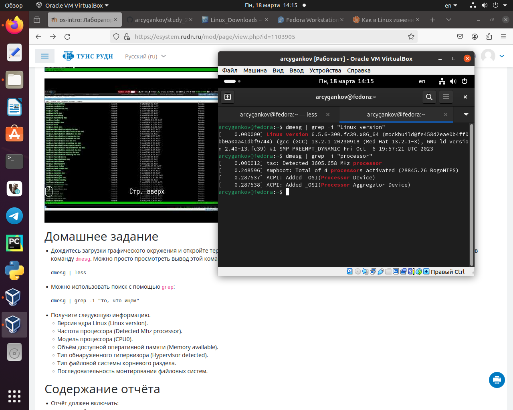 
    {#fig:013 width=70% Detected Mhz processor}
    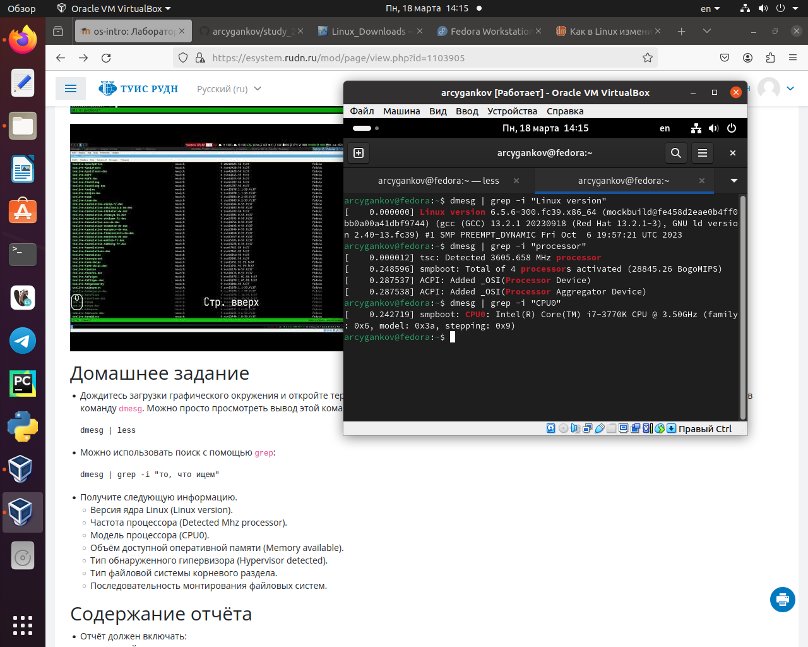 
    {#fig:014 width=70% CPU0}
     
    {#fig:015 width=70% Memory available}
     
    {#fig:016 width=70% Hypervisor detected}
    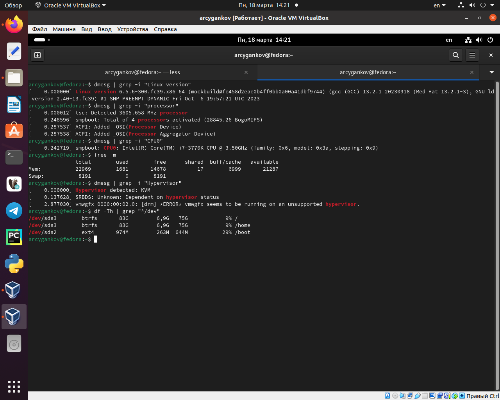
    {#fig:017 width=70% Тип файловой системы корневого раздела}
     
    {#fig:018 width=70% Последовательность монтирования файловых систем}
    

	
	
6. Контрольные вопросы.

- Какую информацию содержит учётная запись пользователя?
Учетная запись пользователя обычно содержит информацию, необходимую для идентификации конкретного пользователя и обеспечения безопасного и легкого доступа к различным ресурсам и услугам. Обычно учетная запись пользователя включает в себя следующую информацию:
    - Системное имя и Полное имя
    - Уникальных идентификатор пользователя в системе

- Укажите команды терминала и приведите примеры:
    - для получения справки по команде - --help;
    - для перемещения по файловой системе - cd;
    - для просмотра содержимого каталога - ls;
    - для определения объёма каталога - du + имя каталога;
    - для создания / удаления каталогов - mkdir/rmdir;
    - для создания / удаления файлов - touch/rm;
    - для задания определённых прав на файл / каталог - chmod;
    - для просмотра истории команд - history;

- Что такое файловая система? Приведите примеры с краткой характеристикой.
это структура, используемая операционной системой для организации и управления файлами на устройстве хранения. Например:
    - FAT - использует таблицу размещения файлов для отслеживания расположения файлов на диске. Однако в ней отсутствуют некоторые дополнительные функции, такие как права доступа к файлам и ведение журнала.
    - NTFS - предлагает расширенные функции, такие как права доступа к файлам, шифрование, сжатие и ведение журнала. NTFS поддерживает большие размеры файлов и разделов, благодаря чему подходит для современных устройств хранения данных. Однако имеет ограниченную совместимость с операционными системами, отличными от Windows.
    - exFAT - устраняет некоторые ограничения FAT32, позволяя использовать файлы большего размера и повышая производительность. exFAT обычно используется для съемных устройств хранения.

- Как посмотреть, какие файловые системы подмонтированы в ОС?
	- С использованием команды df, которая покажет список всех файловых систем по номерам устройств, размеры и данные о памяти. 

- Как удалить зависший процесс?
    - killall - остановит все процессы.
    - kill id-процесса - удалить один процесс с указанным id.

# Выводы

В ходе данной работы я ознакомился с процессом создания виртуальных машин, используя программу VirtualBox. Произвел успешную установку дистрибутива Fedor на созданную виртуальную машину, а также научился производить первичную настройку и отладку операционной системы.
