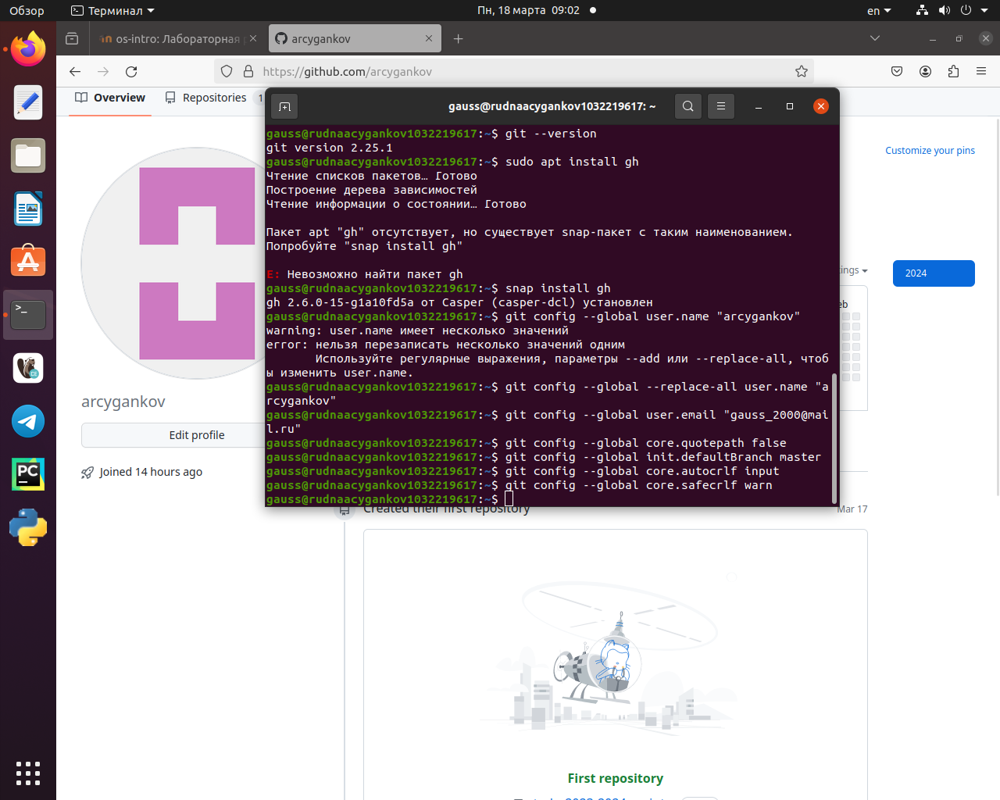
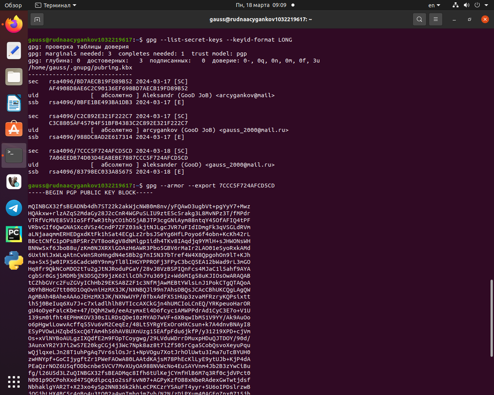
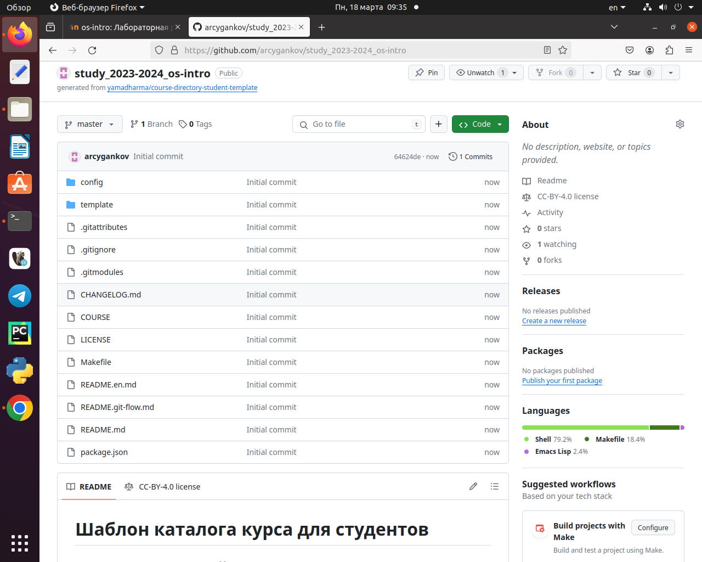
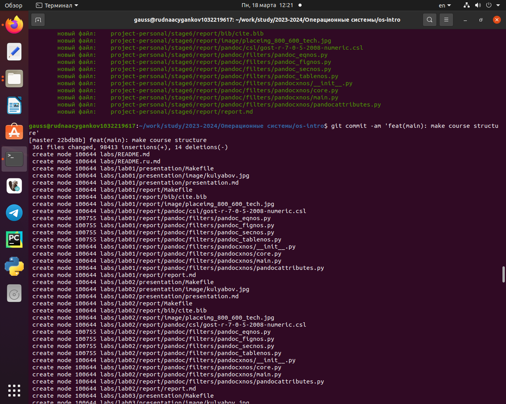

---
## Front matter
title: "Отчёт по лабораторной работе №2"
subtitle: "Дисциплина: Операционные системы"
author: "Цыганков Александр Романович, НПМбВ 02-20"

## Generic otions
lang: ru-RU
toc-title: "Содержание"

## Bibliography
bibliography: bib/cite.bib
csl: pandoc/csl/gost-r-7-0-5-2008-numeric.csl

## Pdf output format
toc: true # Table of contents
toc-depth: 2
lof: true # List of figures
lot: true # List of tables
fontsize: 12pt
linestretch: 1.5
papersize: a4
documentclass: scrreprt
## I18n polyglossia
polyglossia-lang:
  name: russian
  options:
	- spelling=modern
	- babelshorthands=true
polyglossia-otherlangs:
  name: english
## I18n babel
babel-lang: russian
babel-otherlangs: english
## Fonts
mainfont: PT Serif
romanfont: PT Serif
sansfont: PT Sans
monofont: PT Mono
mainfontoptions: Ligatures=TeX
romanfontoptions: Ligatures=TeX
sansfontoptions: Ligatures=TeX,Scale=MatchLowercase
monofontoptions: Scale=MatchLowercase,Scale=0.9
## Biblatex
biblatex: true
biblio-style: "gost-numeric"
biblatexoptions:
  - parentracker=true
  - backend=biber
  - hyperref=auto
  - language=auto
  - autolang=other*
  - citestyle=gost-numeric
## Pandoc-crossref LaTeX customization
figureTitle: "Рис."
tableTitle: "Таблица"
listingTitle: "Листинг"
lofTitle: "Список иллюстраций"
lotTitle: "Список таблиц"
lolTitle: "Листинги"
## Misc options
indent: true
header-includes:
  - \usepackage{indentfirst}
  - \usepackage{float} # keep figures where there are in the text
  - \floatplacement{figure}{H} # keep figures where there are in the text

---

# Цель работы

- Изучить идеологию и применение средств контроля версий.
- Освоить умения по работе с git.

# Задание

1. Первичная настройка параметров git.
2. Создание ключа SSH.
3. Создание ключа PGP.
4. Добавление PGP ключа в GitHub.
5. Настройка автоматических подписей коммитов git.
6. Настройка gh.
7. Шаблон для рабочего пространства.
8. Сознание репозитория курса на основе шаблона.
9. Настройка каталога курса.
10. Контрольные вопросы.

# Теоретическое введение

### Системы контроля версий. Общие понятия

Системы контроля версий (Version Control System, VCS) применяются при работе нескольких человек над одним проектом. Обычно основное дерево проекта хранится в локальном или удалённом репозитории, к которому настроен доступ для участников проекта. При внесении изменений в содержание проекта система контроля версий позволяет их фиксировать, совмещать изменения, произведённые разными участниками проекта, производить откат к любой более ранней версии проекта, если это требуется.

В классических системах контроля версий используется централизованная модель, предполагающая наличие единого репозитория для хранения файлов. Выполнение большинства функций по управлению версиями осуществляется специальным сервером. Участник проекта (пользователь) перед началом работы посредством определённых команд получает нужную ему версию файлов. После внесения изменений, пользователь размещает новую версию в хранилище. При этом предыдущие версии не удаляются из центрального хранилища и к ним можно вернуться в любой момент. Сервер может сохранять не полную версию изменённых файлов, а производить так называемую дельта-компрессию — сохранять только изменения между последовательными версиями, что позволяет уменьшить объём хранимых данных.

Системы контроля версий поддерживают возможность отслеживания и разрешения конфликтов, которые могут возникнуть при работе нескольких человек над одним файлом. Можно объединить (слить) изменения, сделанные разными участниками (автоматически или вручную), вручную выбрать нужную версию, отменить изменения вовсе или заблокировать файлы для изменения. В зависимости от настроек блокировка не позволяет другим пользователям получить рабочую копию или препятствует изменению рабочей копии файла средствами файловой системы ОС, обеспечивая таким образом, привилегированный доступ только одному пользователю, работающему с файлом.

Системы контроля версий также могут обеспечивать дополнительные, более гибкие функциональные возможности. Например, они могут поддерживать работу с несколькими версиями одного файла, сохраняя общую историю изменений до точки ветвления версий и собственные истории изменений каждой ветви. Кроме того, обычно доступна информация о том, кто из участников, когда и какие изменения вносил. Обычно такого рода информация хранится в журнале изменений, доступ к которому можно ограничить.

В отличие от классических, в распределённых системах контроля версий центральный репозиторий не является обязательным.

Среди классических VCS наиболее известны CVS, Subversion, а среди распределённых — Git, Bazaar, Mercurial. Принципы их работы схожи, отличаются они в основном синтаксисом используемых в работе команд.

Примеры использования git

- Система контроля версий Git представляет собой набор программ командной строки. Доступ к ним можно получить из терминала посредством ввода команды git с различными опциями.
- Благодаря тому, что Git является распределённой системой контроля версий, резервную копию локального хранилища можно сделать простым копированием или архивацией.

### основные команды системы git {#tbl:std-dir}

| Название команды | Назначение команды                                                                                                          |
|:--------------|----------------------------------------------------------------------------------------------------------------------------:|
| `git init`          | Создание основного дерева репозитория                                                                               |
| `git pull`      | Получение обновлений (изменений) текущего дерева из центрального репозитория     |
| `git push`       | Отправка всех произведённых изменений локального дерева в центральный репозиторий                                           |
| `git status`      | Просмотр списка изменённых файлов в текущей директории |
| `git diff`     | Просмотр текущих изменений                                                                                   |
| `git add . / git add <имя файла> / git rm <имя файла>`      | Сохранение текущих изменений                                                                                   |
| `git commit / git commit -am "описание коммита"`       | Сохранение добавленных изменений                                                                                                            |
| `git checkout -b имя_ветки`       | Создание новой ветки, базирующейся на текущей                                                                                 |
| `git checkout имя_ветки`       | Переключение на некоторую ветку                                                                                 |
| `git push origin имя_ветки`       | Отправка изменений конкретной ветки в центральный репозиторий                                                                                 
|
| `git branch -D имя_ветки`       | Принудительное удаление локальной ветки                                                                                 |
| `git push origin :имя_ветки`       | Удаление ветки с центрального репозитория                                                                                 |

# Выполнение лабораторной работы

1) Первичная настройка параметров git (рис. @fig:001).

{#fig:001 width=70%}

2) Создание ключа SSH (рис. @fig:002).

{#fig:002 width=70%}

3) Создание ключа  PGP (рис. @fig:003).

{#fig:003 width=70%}

4) Добавление PGP ключа в GitHub (рис. @fig:004, @fig:005).

{#fig:004 width=70%}

{#fig:005 width=70%}

5) Настройка автоматических подписей коммитов git (рис. @fig:006).

{#fig:006 width=70%}

6) Настройка gh (рис. @fig:007, @fig:008).

{#fig:007 width=70%}

{#fig:008 width=70%}

7) Шаблон для рабочего пространства (рис. @fig:009).

{#fig:009 width=70%}

8) Создание локального репозитория курса на основе шаблона (рис. @fig:010).

{#fig:010 width=70%}

9) Настройка каталога курса (рис. @fig:011, @fig:012, @fig:013, @fig:014).

{#fig:011 width=70%}

{#fig:012 width=70%}

{#fig:013 width=70%}

{#fig:014 width=70%}

10) Контрольные вопросы.

1. Что такое системы контроля версий (VCS) и для решения каких задач они предназначаются?

	Система контроля версий - программное обеспечение, применяемое при работе нескольких человек над одним проектом. При внесении изменений в содержание проекта система контроля версий позволяет их фиксировать, совмещать изменения, произведённые разными участниками проекта, производить откат к любой более ранней версии проекта, если это требуется. 

2. Объясните следующие понятия VCS и их отношения: хранилище, commit, история, рабочая копия.
	- Хранилище - хранилище версий. Там хранятся все файлы вместе с их историей, и другой информацией.
	- Commit - сохранение добавленных изменений, их пояснение.
	- История - сохранение всех этапов изменений в проекте, а также возможность просмотреть старые данные и процесс изменений.
	- Рабочая копия - копия проекта, связанная с репозиторием, текущее состояние файлов проекта, основанное на их последней версии из хранилища.

3. Что представляют собой и чем отличаются централизованные и децентрализованные VCS? Приведите примеры VCS каждого вида.
	- Централизованные VCS -  единое основное хранилище для всего проекта. Все пользователь получают для себя необходимые файлы из репозитория, а потом добавляют обратно с изменениями. К ним относятся:
        - TFS 
        - CVS
        - Subversion    
	- Децентрализованные VCS - У каждого пользователя свой репозитория. Каждый пользователь имеет право добавлять и забирать версии из любого репозитория. К ним относятся:
        - Git
        - Bazaar
        - Mercurial
        

4. Опишите действия с VCS при единоличной работе с хранилищем.
	- Создать удалённый репозиторий. Инициализировать его. Отправить данные на сервер.

5. Опишите порядок работы с общим хранилищем VCS.
	- Сначала пользователь получает нужную ему версию с сервера. Затем работает с ней у себя. В итоге он добавляет измененную версию обратно на сервер. При этом сохраняются старые версии, до которых можно откатить проект.

6. Каковы основные задачи, решаемые инструментальным средством git?
	- Хранить информацию обо всех изменениях, производимых в проекте.
	- Дать команде полную информацию о работе каждого ее члена.

7. Приведите примеры использования при работе с локальным и удалённым репозиториями.
	- git merge origin/<текущая-ветка>
	- git remote rename pb paul

8. Что такое и зачем могут быть нужны ветви (branches)?
	- Ветка в Git — это простой перемещаемый указатель на один из таких коммитов. По умолчанию, имя основной ветки в Git — master. Как только вы начнёте создавать коммиты, ветка master будет всегда указывать на последний коммит. Каждый раз при создании коммита указатель ветки master будет передвигаться на следующий коммит автоматически.
	- Ветки используют для разработки новых функций.

9. Как и зачем можно игнорировать некоторые файлы при commit?
	- Игнорировать некоторые файлы можно прописав шаблон (.gitignore) специально для игнорируемых файлов. Это необходимо для того, чтобы в репозиторий не попали файлы, которые будут возникать при работе над проектом. Это могут быть временные файлы, объектные файлы.

10. Назовите и дайте краткую характеристику командам git {#tbl:std-dir}.

| Название команды | Назначение команды                                                                                                          |
|:--------------|----------------------------------------------------------------------------------------------------------------------------:|
| `git init`          | Создание основного дерева репозитория                                                                               |
| `git pull`      | Получение обновлений (изменений) текущего дерева из центрального репозитория     |
| `git push`       | Отправка всех произведённых изменений локального дерева в центральный репозиторий                                           |
| `git status`      | Просмотр списка изменённых файлов в текущей директории |
| `git diff`     | Просмотр текущих изменений                                                                                   |
| `git add . / git add <имя файла> / git rm <имя файла>`      | Сохранение текущих изменений                                                                                   |
| `git commit / git commit -am "описание коммита"`       | Сохранение добавленных изменений                                                                                                            |
| `git checkout -b имя_ветки`       | Создание новой ветки, базирующейся на текущей                                                                                 |
| `git checkout имя_ветки`       | Переключение на некоторую ветку                                                                                 |
| `git push origin имя_ветки`       | Отправка изменений конкретной ветки в центральный репозиторий                                                                                 
|
| `git branch -D имя_ветки`       | Принудительное удаление локальной ветки                                                                                 |
| `git push origin :имя_ветки`       | Удаление ветки с центрального репозитория                                                                                 |

# Выводы

- В ходе лабораторной работы я познакомился с системой контроля версий, а также изучил и на практике освоил работу с GIT.

# Список литературы{.unnumbered}

1. [Руководство к выполнению лабораторной работы №2](https://esystem.rudn.ru/mod/page/view.php?id=970819#org853ec93)

::: {#refs}
:::