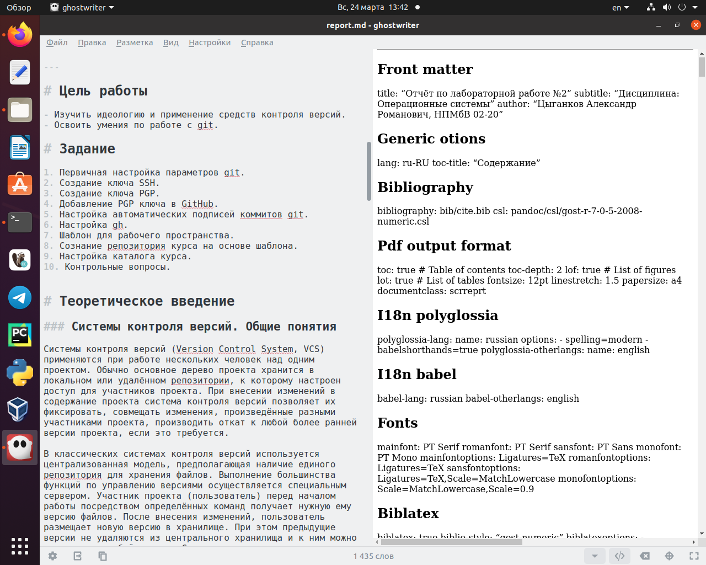
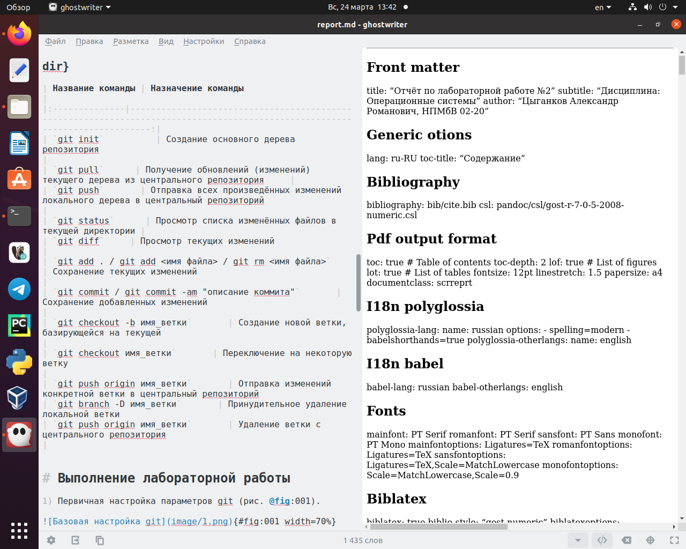
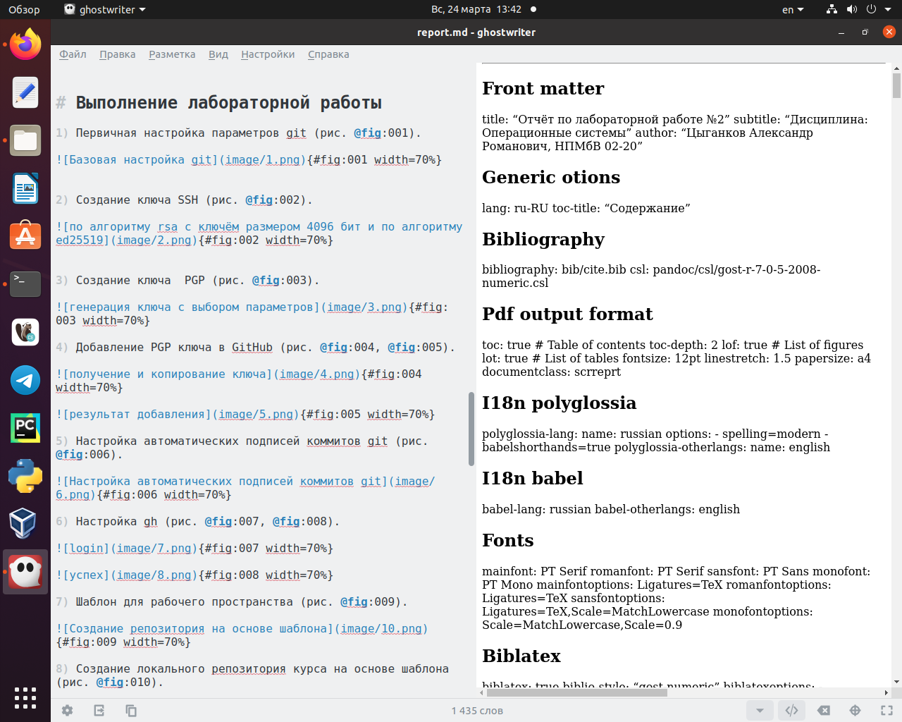
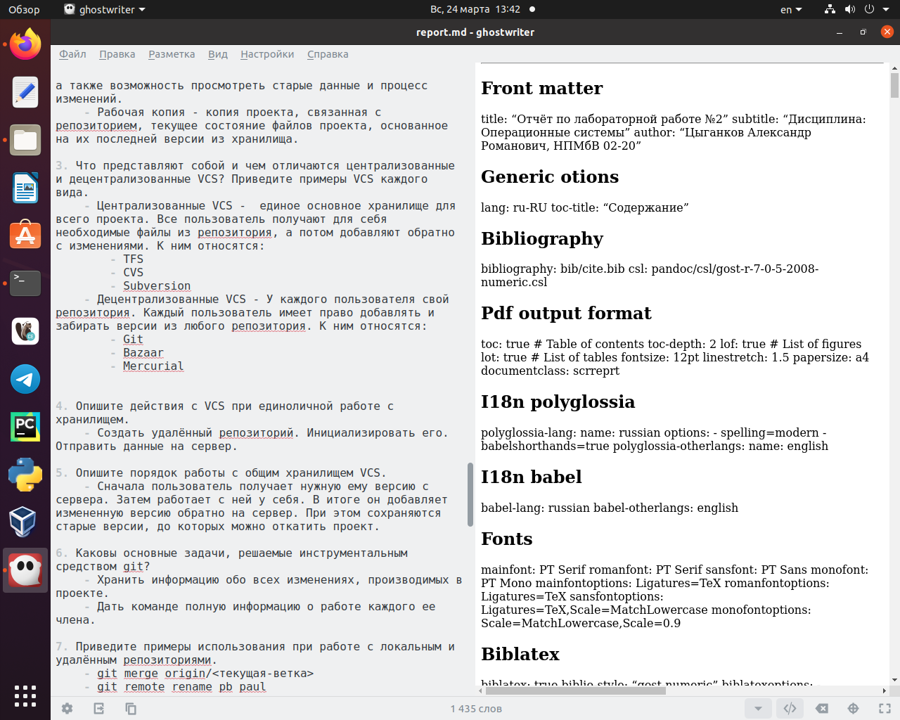

---
## Front matter
lang: ru-RU
title: "Markdown"
subtitle: "Дисциплина: Операционные системы"
author:
  - Цыганков А. Р.
institute:
  - Группа НПМБВ-02-20
  - Российский университет дружбы народов, Москва, Россия
date: 23 марта 2024

## i18n babel
babel-lang: russian
babel-otherlangs: english

## Formatting pdf
toc: false
toc-title: Содержание
slide_level: 2
aspectratio: 169
section-titles: true
theme: metropolis
header-includes:
 - \metroset{progressbar=frametitle,sectionpage=progressbar,numbering=fraction}
 - '\makeatletter'
 - '\beamer@ignorenonframefalse'
 - '\makeatother'
 
---

## Докладчик

:::::::::::::: {.columns align=center}
::: {.column width="70%"}

  * Цыганков Александр Романович
  * Студент 4го курса, группа НПМБВ-02-20
  * Прикладная математика
  * Российский университет дружбы народов
  * [Ссылка на репозиторий гитхаба arcygankov](https://github.com/arcygankov/study_2023-2024_os-intro/tree/master)

:::
::: {.column width="30%"}

:::
::::::::::::::

# Вводная часть

# Markdown.

## Актуальность

- Markdown - удобный язык разметки, прекрасно конвертируемый в такие форматы, как html, pdf, docx и другие. А то, что его можно открыть в любом редакторе текста делает его удобным в использовании.

## Объект и предмет исследования

- Легковесный язык разметки Markdown.

## Цели и задачи

- Приобретение навыков при работе с легковесным языком разметки Markdown.

## Формирование заголовков и задания отчета

{#fig:001 width=70%}

## Создание таблицы для названий команд и их назначений 

{#fig:002 width=70%}

## Описание хода выполнения работы с использованием изображений

{#fig:003 width=70%}

## Формирование вложенных неупорядоченных списков при ответе на контрольные вопросы 

{#fig:004 width=70%}

## Компиляция отчёта

{#fig:005 width=70%}

# Результаты

## Вывод:

В ходе лабораторной мною был изучен синтаксис легковесного языка разметки Markdown и выполнена с его помощью отчёт, по предыдущей лабораторной работе. Стоит отметить, что простота и время, затраченное на это уменьшились по сравнению с обычными программами для создания отчетов.