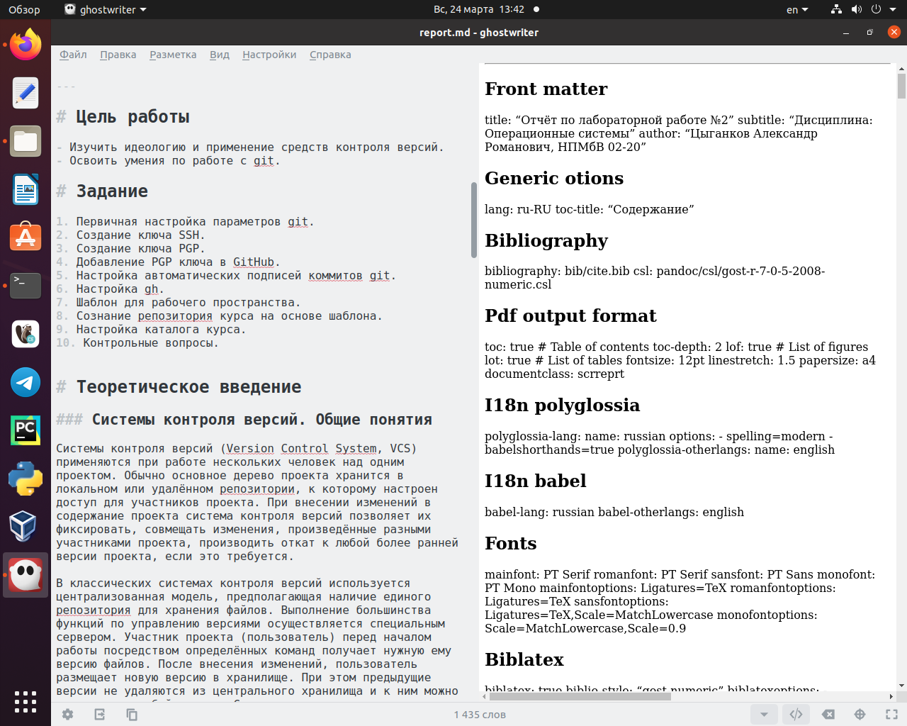
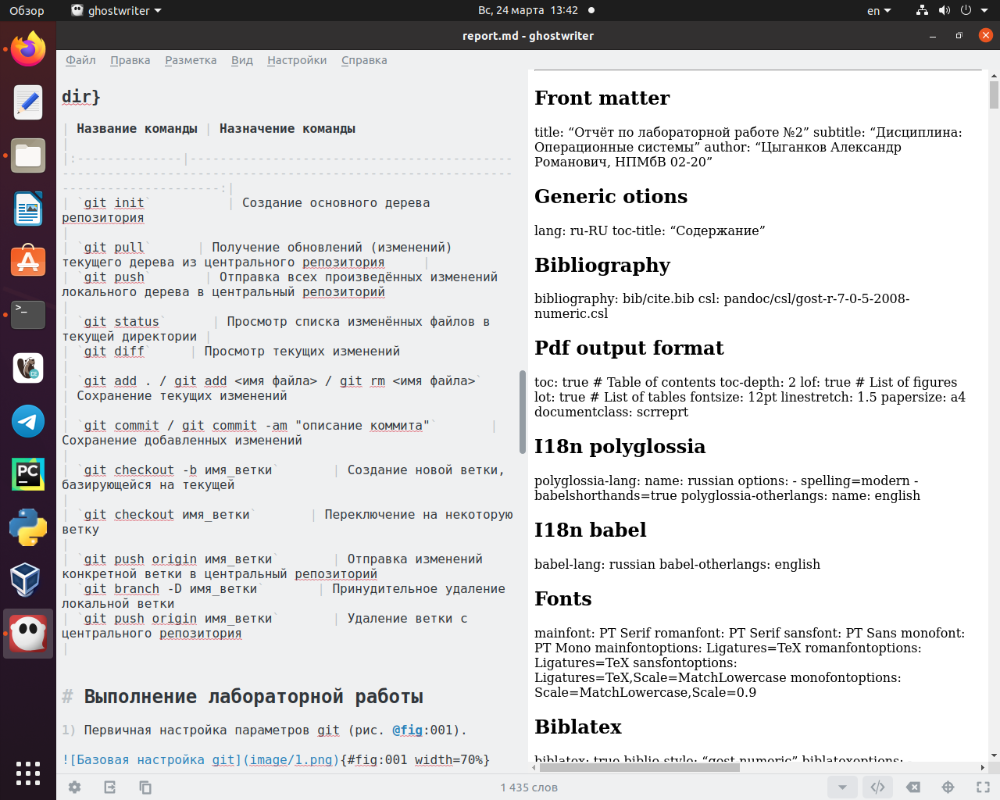
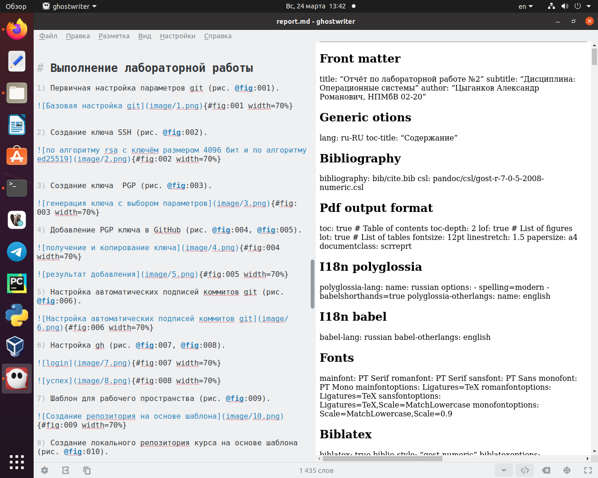
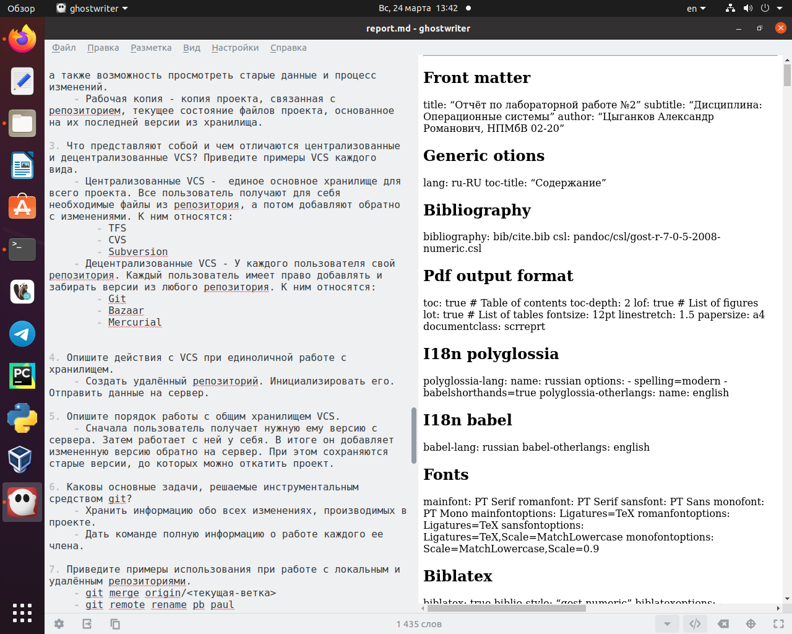
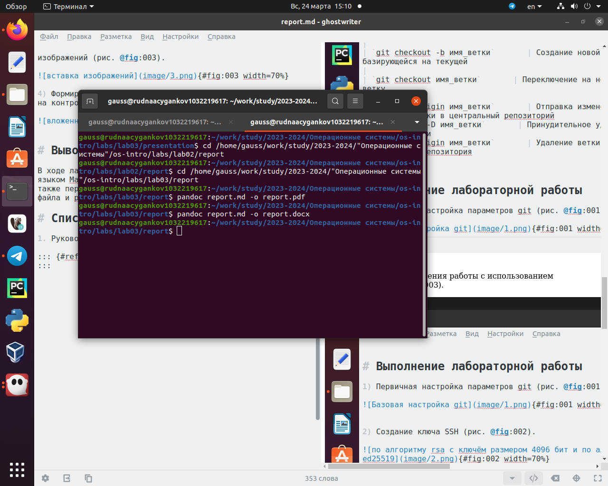

---
## Front matter
title: "Отчёт по лабораторной работе №3"
subtitle: "Markdown"
author: "Цыганков Александр Романович, НПМБВ-02-20"

## Generic otions
lang: ru-RU
toc-title: "Содержание"

## Bibliography
bibliography: bib/cite.bib
csl: pandoc/csl/gost-r-7-0-5-2008-numeric.csl

## Pdf output format
toc: true # Table of contents
toc-depth: 2
lof: true # List of figures
lot: true # List of tables
fontsize: 12pt
linestretch: 1.5
papersize: a4
documentclass: scrreprt
## I18n polyglossia
polyglossia-lang:
  name: russian
  options:
	- spelling=modern
	- babelshorthands=true
polyglossia-otherlangs:
  name: english
## I18n babel
babel-lang: russian
babel-otherlangs: english
## Fonts
mainfont: PT Serif
romanfont: PT Serif
sansfont: PT Sans
monofont: PT Mono
mainfontoptions: Ligatures=TeX
romanfontoptions: Ligatures=TeX
sansfontoptions: Ligatures=TeX,Scale=MatchLowercase
monofontoptions: Scale=MatchLowercase,Scale=0.9
## Biblatex
biblatex: true
biblio-style: "gost-numeric"
biblatexoptions:
  - parentracker=true
  - backend=biber
  - hyperref=auto
  - language=auto
  - autolang=other*
  - citestyle=gost-numeric
## Pandoc-crossref LaTeX customization
figureTitle: "Рис."
tableTitle: "Таблица"
listingTitle: "Листинг"
lofTitle: "Список иллюстраций"
lotTitle: "Список таблиц"
lolTitle: "Листинги"
## Misc options
indent: true
header-includes:
  - \usepackage{indentfirst}
  - \usepackage{float} # keep figures where there are in the text
  - \floatplacement{figure}{H} # keep figures where there are in the text
---

# Цель работы

Научиться оформлять отчёты с помощью легковесного языка разметки Markdown. 

# Задание

1. Выполнить отчёт по лабораторной работе №2 на Markdown.
2. сделать форматы docx, pdf.

# Теоретические сведения

1. Чтобы создать заголовок, используется знак ( # ), например:
	- `# This is heading 1`
	- `## This is heading 2`
    - `### This is heading 3`
    - `#### This is heading 4`

2. Полужирный, курсивный, комбинированный шрифт:
	- This text is `**bold**`
	- This text is `*italic*`
	- This is text is both `***bold and italic***`

3. Цитирование:
	- `>The thing`

4. Списки:
	- `- List item 1`
	- `- List item 2`
	- `- List item 3`

5. Изображения и ссылки:
	- `[link text](file-name.md)`
	- `{#fig:001 width=70%}`

# Выполнение лабораторной работы

1) Формирование заголовков и задания отчета (рис. @fig:001).

{#fig:001 width=70%}

2) Создание таблицы для названий команд и их назначений (рис. @fig:002).

{#fig:002 width=70%}

3) Описание хода выполнения работы с использованием изображений (рис. @fig:003).

{#fig:003 width=70%}

4) Формирование вложенных неупорядоченных списков при ответе на контрольные вопросы (рис. @fig:004).

{#fig:004 width=70%}

4) создание других форматов (рис. @fig:005).

{#fig:005 width=70%}

# Выводы

В ходе лабораторной работы я ознакомился с легковесным языком Markdown. Научился с его помощью оформлять отчеты, а также переводить их в другие форматы с помощью исполняемного файла и pandoc.

# Список литературы{.unnumbered}

1. Руководство к выполнению лабораторной №3

::: {#refs}
:::