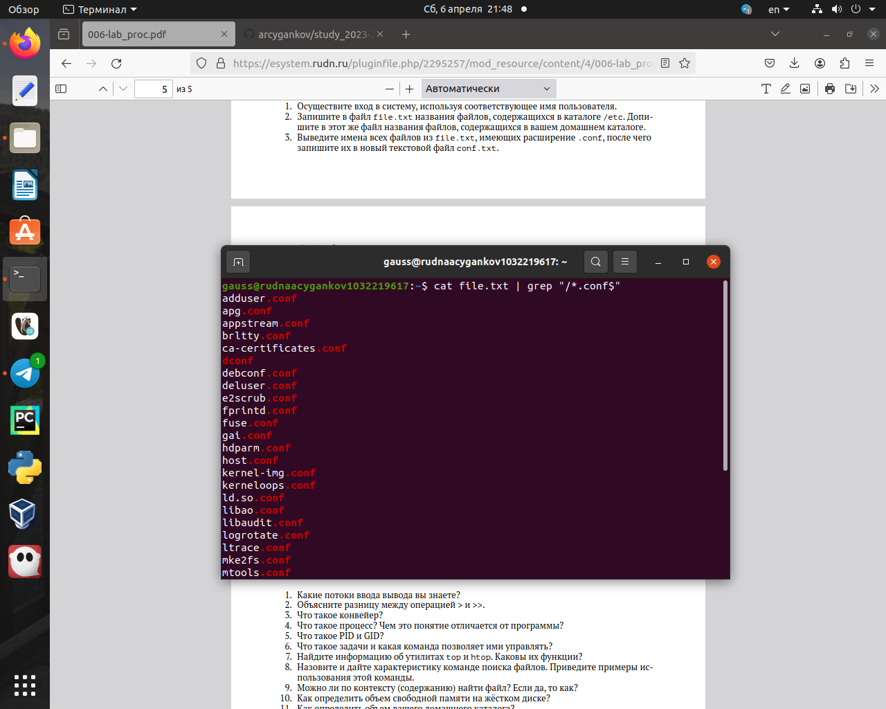
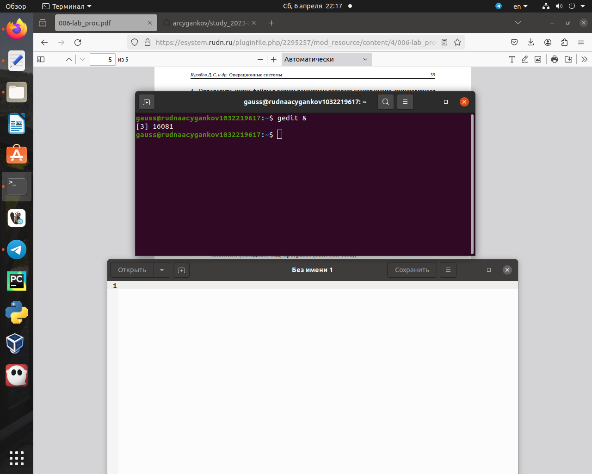
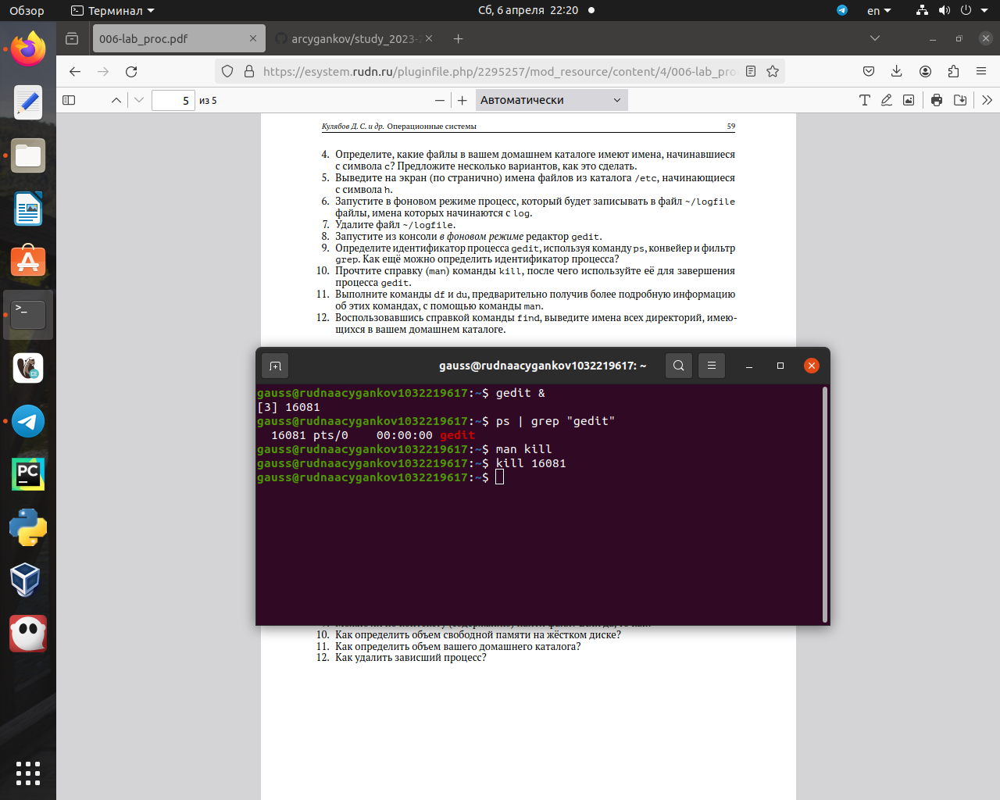
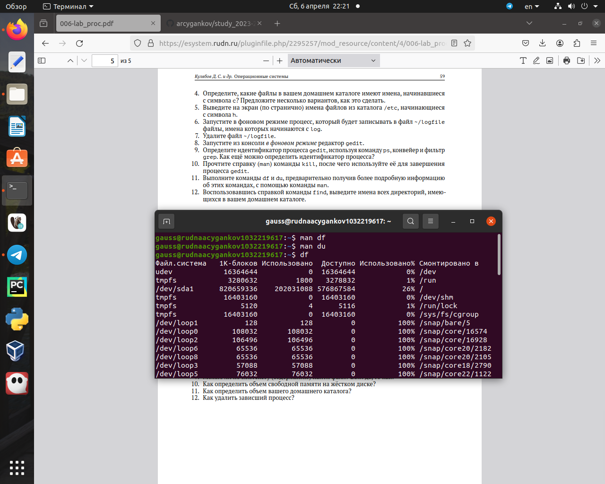
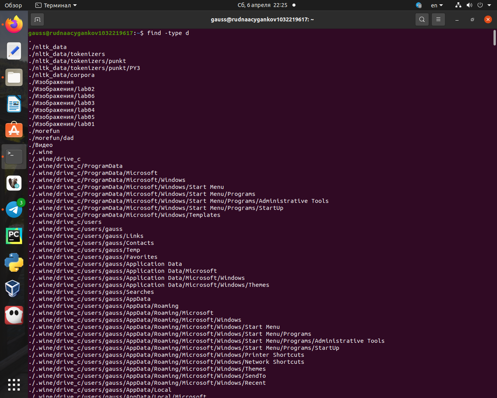

---
## Front matter
lang: ru-RU
title: "Лабораторная работа №6. Поиск файлов. Перенаправление ввода-вывода. Просмотр запущенных процессов"
subtitle: "Дисциплина: Операционные системы"
author:
  - Цыганков А. Р.
institute:
  - Группа НПМБВ-02-20
  - Российский университет дружбы народов, Москва, Россия
date: 6 апреля 2024

## i18n babel
babel-lang: russian
babel-otherlangs: english

## Formatting pdf
toc: false
toc-title: Содержание
slide_level: 2
aspectratio: 169
section-titles: true
theme: metropolis
header-includes:
 	- \makeatletter
 	- \metroset{progressbar=frametitle,sectionpage=progressbar,numbering=fraction}
 	- \beamer@ignorenonframefalse
 	- \makeatother
---

# Информация

## Докладчик

:::::::::::::: {.columns align=center}
::: {.column width="70%"}

  * Цыганков Александр Романович
  * Студент 4го курса, группа НПМБВ-02-20
  * Компьютерные и информационные науки
  * Российский университет дружбы народов
  * [Ссылка на репозиторий гитхаба arcygankov](https://github.com/arcygankov/study_2023-2024_os-intro)

:::
::: {.column width="30%"}

:::
::::::::::::::

# Вводная часть

## Актуальность

- Умение быстро находить нужные файлы, логи в системе важная задача, которая экономит время. Также важно уметь следить за процессами и систематизировать вывод команд.

## Объект и предмет исследования

- Команды для поиска файлов и фильтрации текстовых данных, а также отслеживания процессов.

## Цели и задачи

- Ознакомление с инструментами поиска файлов и фильтрации текстовых данных. Приобретение практических навыков: по управлению процессами (и заданиями), по проверке использования диска и обслуживанию файловых систем.

# Выполнение заданий.

## Запишите в файл file.txt названия файлов, содержащихся в каталоге /etc

{#fig:001 width=70%}

## Выведите имена всех файлов из file.txt, имеющих расширение .conf

{#fig:002 width=70%}

## Определите, какие файлы в вашем домашнем каталоге имеют имена, начинавшиеся с символа c?

![ls -a | grep `^[c]`](image/5.png){#fig:003 width=70%}

## Запустите в фоновом режиме процесс, который будет записывать в файл ~/logfile файлы, имена которых начинаются с log

{#fig:004 width=70%}

## Запустите из консоли в фоновом режиме редактор gedit. Определите идентификатор процесса gedit, используя команду ps, конвейер и фильтр grep. Как ещё можно определить идентификатор процесса?

{#fig:005 width=70%}

## Используйте kill для завершения процесса gedit

{#fig:006 width=70%}

## Выполните команду df

{#fig:007 width=70%}

## Воспользовавшись find, выведите имена всех директорий, имеющихся в вашем домашнем каталоге

{#fig:008 width=70%}

## find

{#fig:009 width=70%}

# Результаты

## Вывод:

В ходе выполнения лабораторной работы я освоил поиск файлов и фильтрацию текстовых данных, направления процессов. Приобрел практические навыки по управлению процессами (и заданиями), по проверке использования диска и обслуживанию файловых систем.