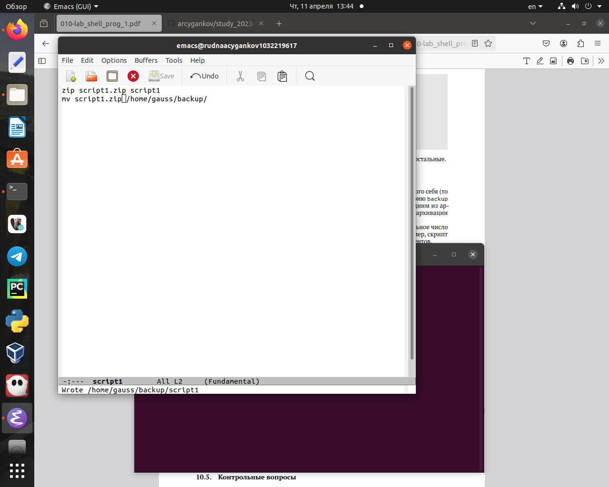
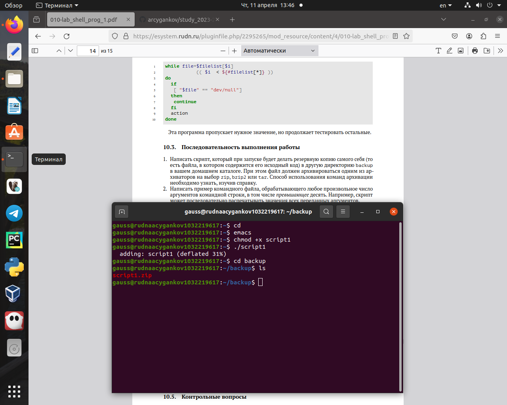
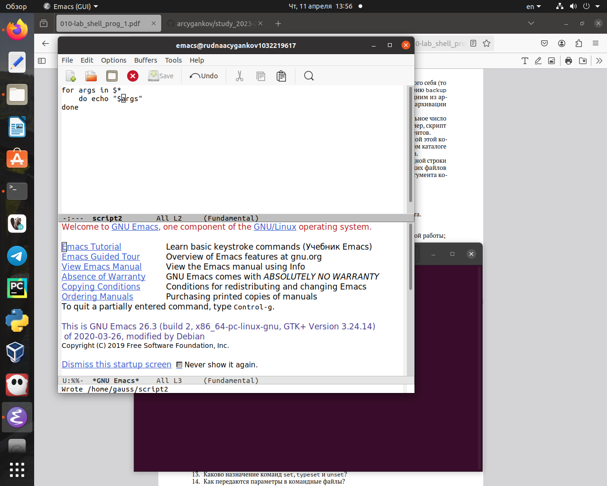
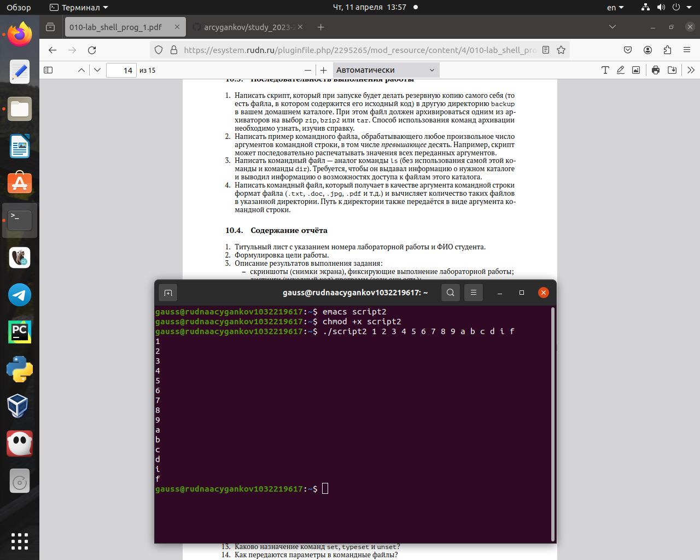
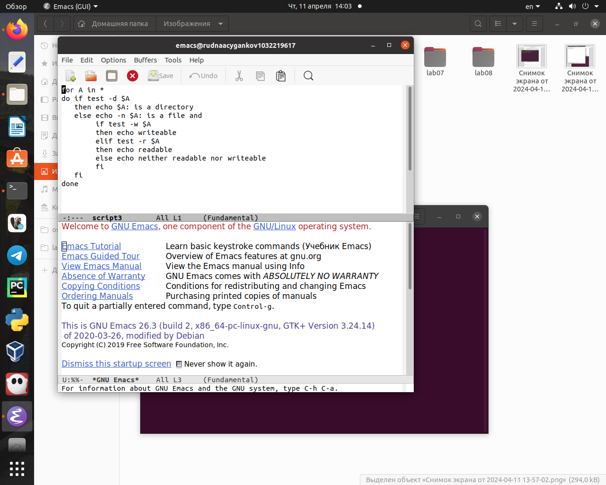

---
## Front matter
lang: ru-RU
title: "Лабораторная работа №9. Программирование в командном процессоре OC UNIX. Командные файлы"
subtitle: "Дисциплина: Операционные системы"
author:
  - Цыганков А. Р.
institute:
  - Группа НПМБВ-02-20
  - Российский университет дружбы народов, Москва, Россия
date: 11 апреля 2024

## i18n babel
babel-lang: russian
babel-otherlangs: english

## Formatting pdf
toc: false
toc-title: Содержание
slide_level: 2
aspectratio: 169
section-titles: true
theme: metropolis
header-includes:
 - \metroset{progressbar=frametitle,sectionpage=progressbar,numbering=fraction}
 - '\makeatletter'
 - '\beamer@ignorenonframefalse'
 - '\makeatother'
---

# Информация

## Докладчик

:::::::::::::: {.columns align=center}
::: {.column width="70%"}

  * Цыганков Александр Романович
  * Студент 4-го курса, группа НПМБВ-02-20
  * Прикладная математика
  * Российский университет дружбы народов
  * [Ссылка на репозиторий гитхаба arcygankov](https://github.com/arcygankov/study_2023-2024_os-intro)

:::
::: {.column width="30%"}

:::
::::::::::::::

# Вводная часть

## Актуальность

- Умение создавать скрипты существенно ускорит у упростит выполнение рутинных задач в терминале.

## Объект и предмет исследования

- Командный процессор ОС UNIX

## Цели и задачи

- Изучить основы программирования в оболочке ОС UNIX/Linux. Научиться писать небольшие командные файлы.

# Выполнение заданий.

## Написать скрипт, который при запуске будет делать резервную копию самого себя (то есть файла, в котором содержится его исходный код) в другую директорию backup в вашем домашнем каталоге. При этом файл должен архивироваться одним из архиваторов на выбор zip, bzip2 или tar. Способ использования команд архивации необходимо узнать, изучив справку (см. рис. @fig:001, @fig:002, @fig:003).

{#fig:001 width=70%}

{#fig:002 width=70%}

{#fig:003 width=70%}

## Написать пример командного файла, обрабатывающего любое произвольное число аргументов командной строки, в том числе превышающее десять. Например, скрипт может последовательно распечатывать значения всех переданных аргументов (см. рис. @fig:004, @fig:005).

{#fig:004 width=70%}

{#fig:005 width=70%}

## Написать командный файл - аналог команды ls (без использования самой этой команды и команды dir). Требуется, чтобы он выдавал информацию о нужном каталоге и выводил информацию о возможностях доступа к файлам этого каталога (см. рис. @fig:006, @fig:007).

{#fig:006 width=70%}

{#fig:007 width=70%}

## Написать командный файл, который получает в качестве аргумента командной строки формат файла (.txt, .doc, .jpg, .pdf и т.д.) и вычисляет количество таких файлов в указанной директории. Путь к директории также передаётся в виде аргумента командной строки (см. рис. @fig:008, @fig:009).

{#fig:008 width=70%}

{#fig:009 width=70%}

# Результаты

## Вывод:

В ходе выполнения лабораторной работы я изучил основы программирования в оболочке ОС UNIX/Linux. Научился писать небольшие командные файлы.