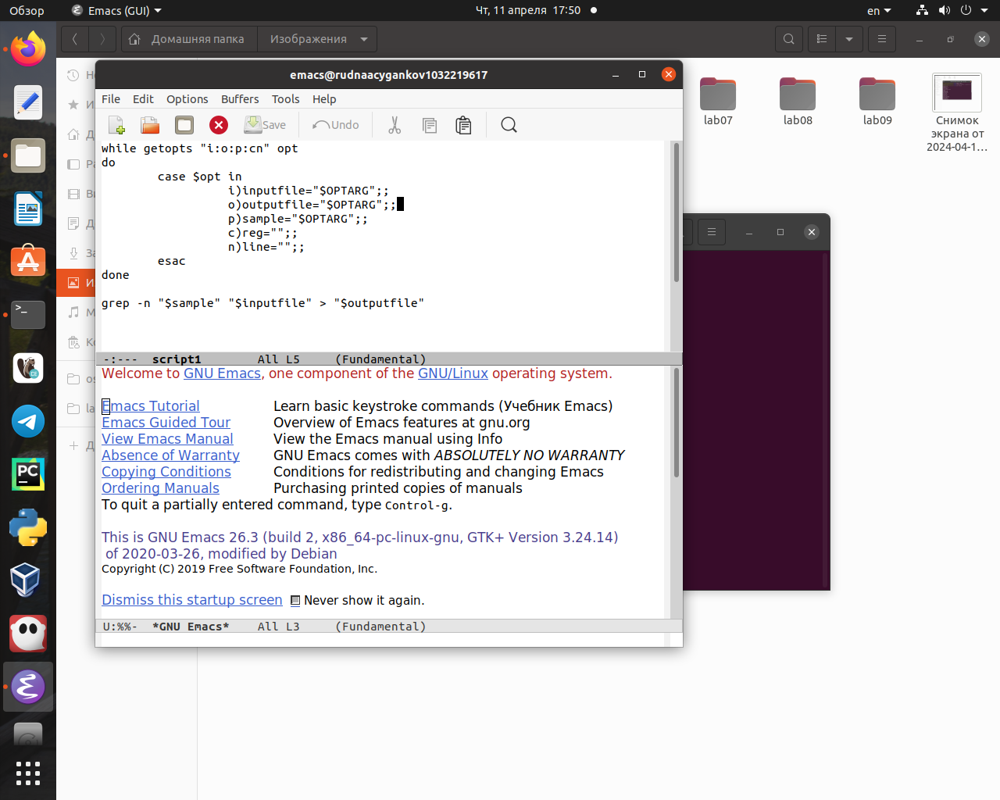
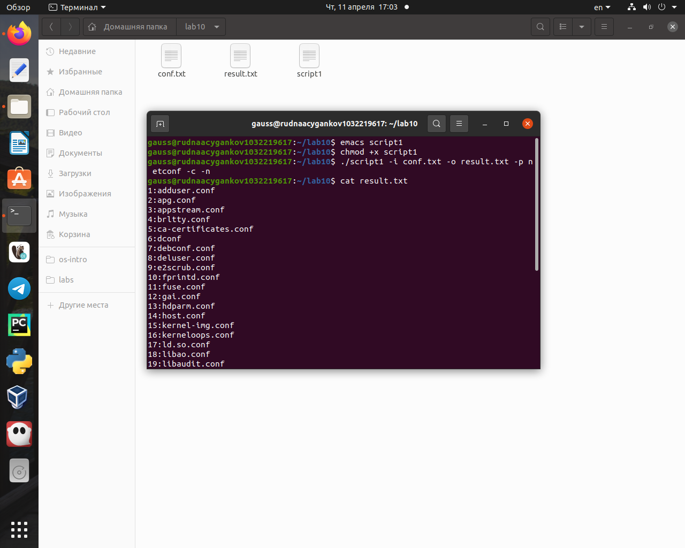
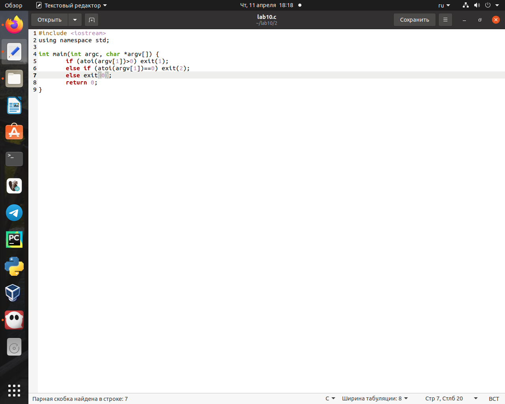
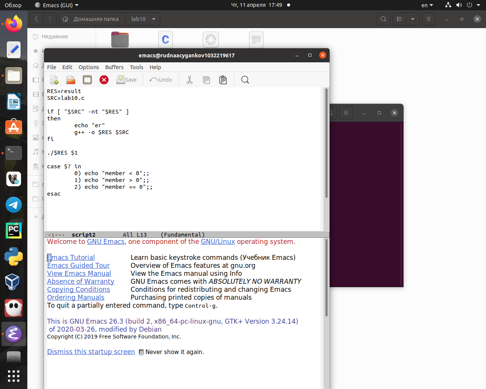
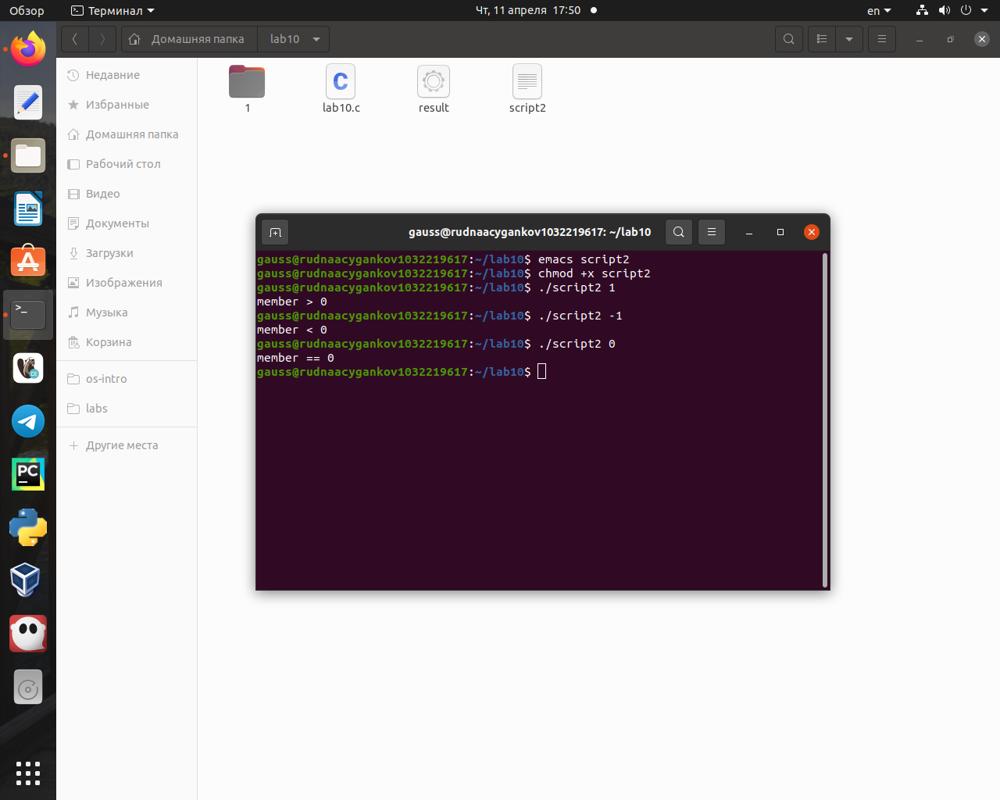
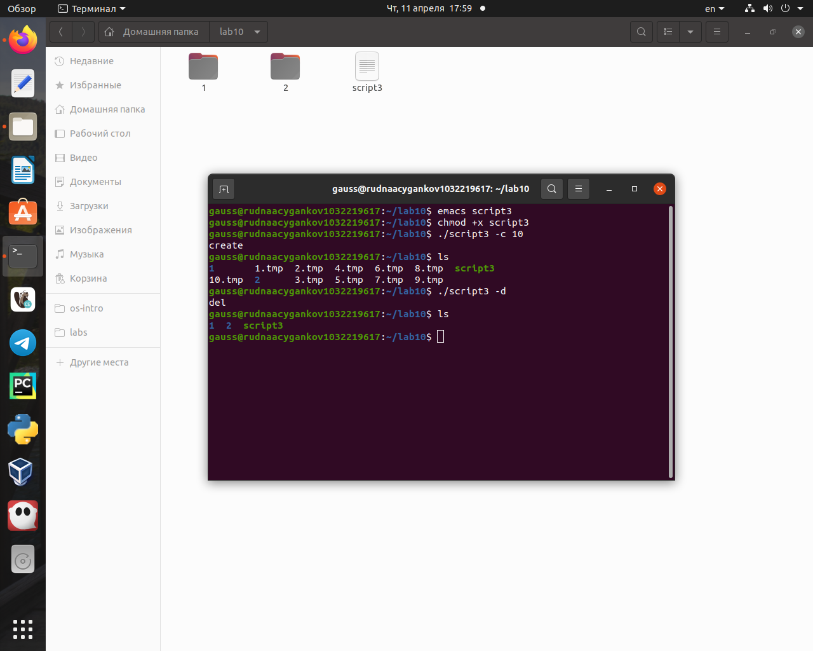
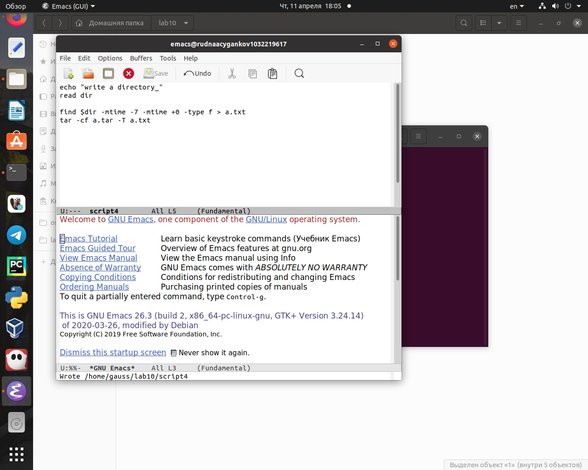
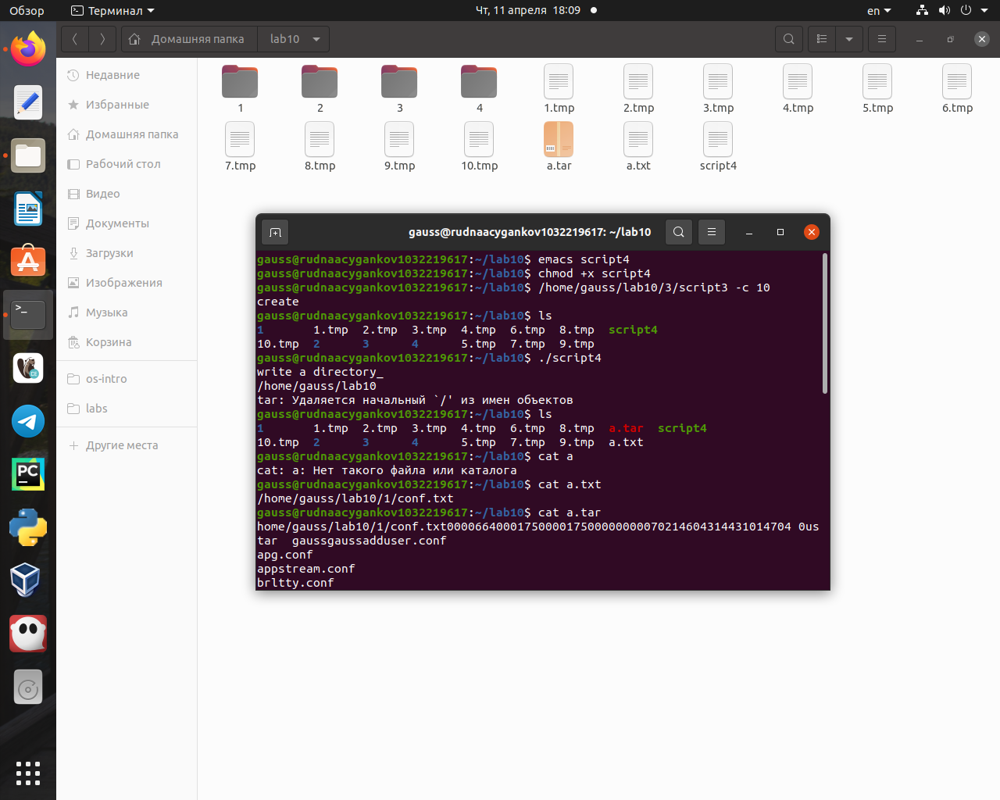

---
## Front matter
lang: ru-RU
title: "Лабораторная работа №10. Программирование в командном процессоре ОС UNIX. Ветвления и циклы"
subtitle: "Дисциплина: Операционные системы"
author:
  - Цыганков А. Р.
institute:
  - Группа НПМБВ-02-20
  - Российский университет дружбы народов, Москва, Россия
date: 11 апреля 2024

## i18n babel
babel-lang: russian
babel-otherlangs: english

## Formatting pdf
toc: false
toc-title: Содержание
slide_level: 2
aspectratio: 169
section-titles: true
theme: metropolis
header-includes:

# Информация

## Докладчик

# Вводная часть

## Актуальность

создание более сложных программ позволит решать более сложные задачи.

## Объект и предмет исследования

Командный процессор ОС UNIX

## Цели и задачи

Изучить основы программирования в оболочке ОС UNIX. Научится писать более сложные командные файлы с использованием логических управляющих конструкций и циклов.

# Выполнение заданий.

## Используя команды getopts grep, написать командный файл, который анализирует командную строку с ключами:
    - -iinputfile — прочитать данные из указанного файла;
    - -ooutputfile — вывести данные в указанный файл;
    - -pшаблон — указать шаблон для поиска;
    - -C — различать большие и малые буквы;
    - -n — выдавать номера строк. а затем ищет в указанном файле нужные строки, определяемые ключом -p. (рис. @fig:001, @fig:002)

{#fig:001 width=70%}

{#fig:002 width=70%}

## Написать на языке Си программу, которая вводит число и определяет, является ли оно больше нуля, меньше нуля или равно нулю. Затем программа завершается с помощью функции exit(n), передавая информацию в о коде завершения в оболочку. Командный файл должен вызывать эту программу и, проанализировав с помощью команды $?, выдать сообщение о том, какое число было введено (рис. @fig:003, @fig:004, @fig:005). 

{#fig:003 width=70%}

{#fig:004 width=70%}

{#fig:005 width=70%}

## Написать командный файл, создающий указанное число файлов, пронумерованных последовательно от 1 до N (например 1.tmp, 2.tmp, 3.tmp,4.tmp и т.д.). Число файлов, которые необходимо создать, передаётся в аргументы командной строки. Этот же командный файл должен уметь удалять все созданные им файлы (если они существуют) (рис. @fig:006, @fig:007).

{#fig:006 width=70%}

{#fig:007 width=70%}

## Написать командный файл, который с помощью команды tar запаковывает в архив все файлы в указанной директории. Модифицировать его так, чтобы запаковывались только те файлы, которые были изменены менее недели тому назад (использовать команду find) (рис. @fig:008, @fig:009).

{#fig:008 width=70%}

{#fig:009 width=70%}

# Результаты

## Вывод:

В процессе выполнения данной лабораторной работы я изучил основы программирования в оболочке ОС UNIX. Научился применять ветвление и циклы в написании скриптов.